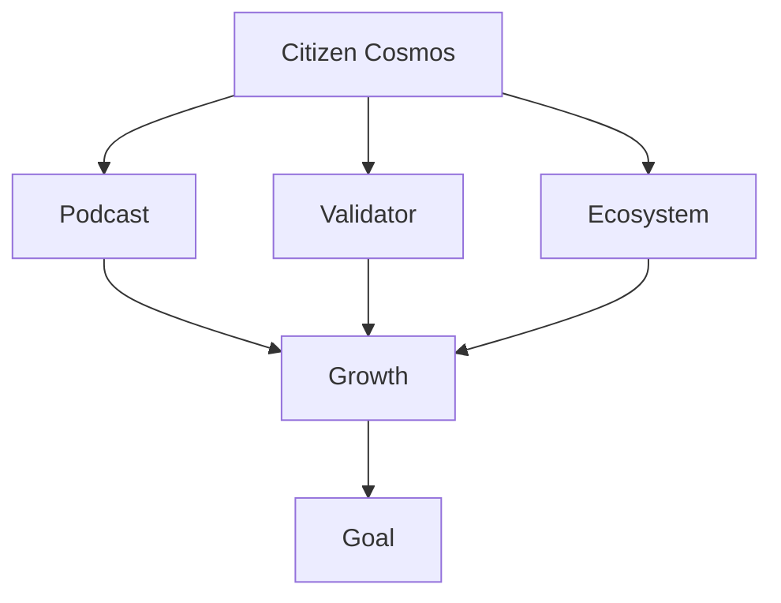

# Citizen Cosmos: brand roadmap

## Mission

Discovering web3 via the means of communication and as a functioning example of a web3 business. Citizen Cosmos started as [a podcast](https://www.citizencosmos.space/), helping the curious to discover the Cosmos ecosystem with the help of personal stories of web3 builders and their ambitions to turn code into reality. Slowly, Citizen Cosmos grew as a brand, helping to shape the community and the ecosystem by securing and supporting ecosystem networks as a validator and by running various, public initiatives, such as, organizing local and online meetups, social media management, translations, etc.

Our mission is to make the world decentralized and to prove that communication is the key. By learning to use the tools that web3 provides us, we are shaping our organization as a web3 entity and explaining how to use these tools to make your life easier, from wherever you may be geographically based.

## Aim

To make web3 an everyday instrument in peoples lives, by using it, becoming a part of it and helping others to learn how to use it. The question that we are trying to answer, is:

`What is web3 good for? Why do I need to use it? How can I take advantage of these tools? Can I earn while I do this? Why do I need to care about web3?`

We believe that the best way to answer these questions, is by providing the necessary information and the tools to go along with that information. By utilizing and using them in our every day lives. Hence, our aim is trying to prove that web3, blockchain, and what is known as the `hustler economy` are a means, that not only work and function, but are available to use by anyone to build their own business around it.

## Architecture

The current architecture of `Citizen Cosmos`, often abbreviated to `C.C.` or `CC` is outlined in the [flowchart](#flowchart) below. The brand unifies the `Citizen Cosmos podcast`, the `Citizen Cosmos validator` and the public community work done by Citizen Cosmos, under the name: `cosmos_rus`.

Aims of each product:
- Citizen Cosmos podcast: allows people to get familiar with web3 via Cosmos and the personal stories of its builders. From here, each user can find their own `role model` to connect with, or simply use the show as an educational and informative resource, that can ease the journey into the depth of web3
- Citizen Cosmos validator: is the main source of income for the brand. The idea is to show that web3 can be used to provide the necessary tools that allow people to run a business and earn a passive income with the help of such tools. In the future, a lot of the technological initiatives that C.C. does will be build upon this part of the project
- Cosmos_rus: the butter to the bread. An additional way for C.C. to share information about web3. This includes the [Cosmos Moscow meetup group](https://www.meetup.com/Cosmos-Moscow), and the various SM channels that we manage. Just like a pub needs to have music to attract more guests, our brand utilizes this separate project to help attract more users and interest towards C.C. It also serves as a possible means of income for C.C. from possible community and / or ICF grants

## Tools

- [Main working task board](https://github.com/orgs/citizen-cosmos/projects/1)
- [Other resources](https://github.com/citizen-cosmos/Citizen-Cosmos#citizen-cosmos)

## Flowchart

Created using [Mermaid](https://github.com/mermaid-js/mermaid). Visible with the help of [this extension](https://github.com/BackMarket/github-mermaid-extension) (add it to your favourite browser via the add-ons manager and turn it on). 

------------------------------

### C.C. podcast

The Citizen Cosmos podcast is its main source of communication and its main working tool. To achieve our goal, 4 major tasks require completion:  

- [ ] [Forming a vision](#forming-a-vision)
- [ ] [Administrative questions](#administrative-questions)
- [ ] [Shaping the ecosystem](#ecosystem-and-pr)
- [ ] [Growth](#growth)

#### Forming a vision

Create the initial steps, required to shape the brand:

- [ ] [Create and publish a roadmap](https://github.com/citizen-cosmos/Citizen-Cosmos/issues/28)
- [ ] [Create a marketing plan for the podcast](https://github.com/citizen-cosmos/Citizen-Cosmos/issues/44)

#### Administrative questions

Questions relating to administrative tasks:

- [x] [CC community advocate](https://github.com/citizen-cosmos/Citizen-Cosmos/issues/29)
- [x] [Branding](https://github.com/citizen-cosmos/Citizen-Cosmos/issues/46)
- [x] [Accountancy](https://github.com/citizen-cosmos/Citizen-Cosmos/issues/47)
- [ ] [Missing equipment](https://github.com/citizen-cosmos/Citizen-Cosmos/issues/48)
- [x] [GH documentation order]()
- [ ] [Editing: payments & work flow]()
- [ ] [Guest sound guidelines](https://github.com/citizen-cosmos/Citizen-Cosmos/issues/30)
- [x] [Hosting platform: payments]()
- [ ] [Communication channels](https://github.com/citizen-cosmos/Citizen-Cosmos/issues/44)
- [ ] [Own website / app](https://github.com/citizen-cosmos/Citizen-Cosmos/issues/49)
- [ ] [Public grants](https://github.com/citizen-cosmos/Citizen-Cosmos/issues/20)

#### Ecosystem and PR

These are vastly ongoin tasks that constantly require attention:

- [x] [Create working guidelines and flows](https://github.com/citizen-cosmos/Citizen-Cosmos/tree/master/project)
- [ ] [Transcripts for each episode](https://github.com/citizen-cosmos/Citizen-Cosmos/issues/51)
- [ ] [Video (picture) podcast version](https://github.com/citizen-cosmos/Citizen-Cosmos/issues/50)
- [ ] [TG stickers](https://github.com/citizen-cosmos/Citizen-Cosmos/issues/33)
- [ ] [Community episode](https://github.com/citizen-cosmos/Citizen-Cosmos/issues/35)
- [ ] [Customer journey experience](https://github.com/citizen-cosmos/Citizen-Cosmos/issues/22)
- [ ] [Mentioned blockchain projects list for educational purposes](https://github.com/citizen-cosmos/Citizen-Cosmos/issues/21)
- [ ] [Cross podcast work](https://github.com/citizen-cosmos/Citizen-Cosmos/issues/38)
- [ ] [Guest lists](https://github.com/citizen-cosmos/Citizen-Cosmos/issues/9)
- [ ] [Semantics core](https://github.com/citizen-cosmos/Citizen-Cosmos/issues/44)
- [ ] [Blog presence](https://github.com/citizen-cosmos/Citizen-Cosmos/issues/44)

#### Growth

Future visionary plans that can help to shape the bigger picture. Should be taken with a pinch of salt:

- [ ] [Bitsong]()
- [ ] [Citizen Dot]()
- [ ] [DAO & NFT]()
- [ ] [Grants and community pools](https://github.com/citizen-cosmos/Citizen-Cosmos/issues/20)
- [ ] [Decentraland zone]()
- [ ] [citizencosmos.eth](https://github.com/citizen-cosmos/Citizen-Cosmos/issues/7)
- [ ] [re-link website using cyber.page]()
- [ ] [IPFS cluster](https://github.com/citizen-cosmos/Citizen-Cosmos/issues/7)
- [ ] [Host personification]()

------------------------------

### C.C. Validator

The Citizen Cosmos validator is its main source of income and one of its communication means. To achieve its goal 2 major tasks are outlined:

- [ ] [Administrive questions](#administrative-questions-1)
- [ ] [Growth and ecosystem](#growth-and-ecosystem)

#### Administrative questions
- [x] [Devops]()
- [ ] [Threshold signing](https://github.com/citizen-cosmos/Staking/issues/3)
- [ ] [Migration]()
- [ ] [Server payments & accountancy]()

#### Growth and ecosystem
- [ ] [Website / App]()
- [ ] [Plan for liveliness in participating networks]() 
- [ ] [Supporting network plan](https://github.com/citizen-cosmos/Staking/issues/10)
- [ ] [Guides and network description](https://github.com/citizen-cosmos/Staking/issues/9)
- [ ] [Community advocacy presence](https://github.com/citizen-cosmos/Staking/issues/9) 
- [ ] [Semantics core](https://github.com/citizen-cosmos/Staking/issues/9)
- [ ] [CC Melon fund]()
- [ ] [Public comments to media](https://github.com/citizen-cosmos/Staking/issues/9)

------------------------------

### C.C. community initiatives

The Citizen Cosmos runs various public community iniatives to help communicate its end goal to users. To achieve it, 3 major tasks are outlined:

- [ ] [Administrive questions](#administrative-questions-2)
- [ ] [Ongoing initiatives](#ongoing-iniatives)
- [ ] [Public events](#public-events)

#### Administrative questions
- [ ] [CC RU community advocate](https://github.com/citizen-cosmos/Citizen-Cosmos/issues/53)
- [ ] [Grant work](https://github.com/citizen-cosmos/Citizen-Cosmos/issues/20)

#### Ongoing iniatives 
- [ ] [TIC translations](https://github.com/citizen-cosmos/Citizen-Cosmos/issues/56)
- [ ] [SM work: Twitter, TG, forum](https://github.com/citizen-cosmos/Citizen-Cosmos/issues/56)
- [ ] Public good repositories: [1](https://github.com/citizen-cosmos/Awesome-cosmos-social) & [2](https://github.com/citizen-cosmos/Awesome-cosmos-ru)

#### Public events
- [ ] [Cosmos Moscow meetup work: community calls, cosmos po-russki](https://github.com/citizen-cosmos/Citizen-Cosmos/issues/56): Technical team payments
- [ ] [RU Hakaton](https://github.com/citizen-cosmos/Citizen-Cosmos/issues/56)
