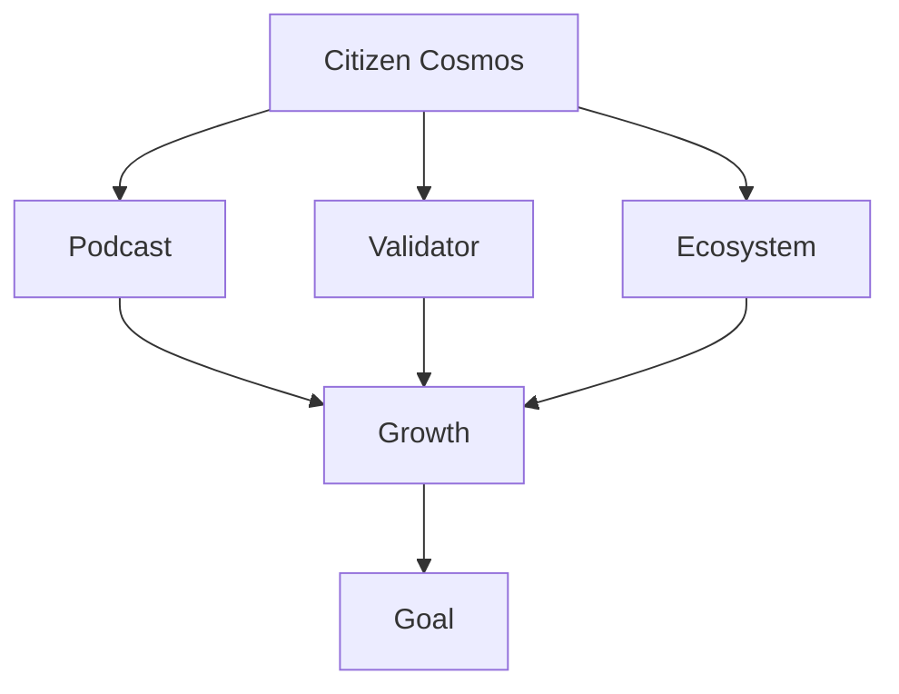

# Citizen Cosmos: brand roadmap

## Goal

Helping to discover web3 via the means of communication. Citizen Cosmos stated as [a podcast](https://www.citizencosmos.space/), helping the curious to discover the Cosmos ecosystem via personal stories of web3 builders, their ambitions to turn code into reality. Citizen Cosmos grew into a brand, helping with the formation of community and the ecosystem by securing and supporting various ecosystem networks as a validator, and by running such initiatives, as the organization of local meetups, social media management, translations, etc. Our aim is to make web3 an everyday instrument in people life, by using it, becoming a part of it and helping others to journey with us.

## Tools

- [Main working task board](https://github.com/orgs/citizen-cosmos/projects/1)
- [Other resources](https://github.com/citizen-cosmos/Citizen-Cosmos#citizen-cosmos)

## Flowchart

Created using [Mermaid](https://github.com/mermaid-js/mermaid). Visible with the help of [this extension](https://github.com/BackMarket/github-mermaid-extension) 

### C.C. podcast

The Citizen Cosmos podcast is its main source of communication and its main working tool. To achieve our goal 4 major tasks require completion:  

- [ ] [Forming a vision](#forming-a-vision)
- [ ] [Administrative questions](#administrative-questions)
- [ ] [Shaping the ecosystem](#ecosystem-and-pr)
- [ ] [Growth](#growth)

##### Forming a vision

Create the initial steps, required to shape the product:

- [ ] [Create and publish a roadmap](https://github.com/citizen-cosmos/Citizen-Cosmos/issues/28)
- [ ] [Create a marketing plan for the podcast](https://github.com/citizen-cosmos/Citizen-Cosmos/issues/44)

##### Administrative questions

Sort out all issues relating to administrative things:

- [ ] [CC community advocate](https://github.com/citizen-cosmos/Citizen-Cosmos/issues/29)
- [ ] [Branding]()
- [ ] [Accountancy]()
- [ ] [Missing equipment]()
- [ ] [GH documentation order]()
- [ ] [Editing: payments & work flow]()
- [ ] [Guest sound guidelines](https://github.com/citizen-cosmos/Citizen-Cosmos/issues/30)
- [ ] [Hosting platform: payments]()
- [ ] [Communication channels]()
- [ ] [Own website / app]()
- [ ] [ICF grant]()

##### Ecosystem and PR

These are vastly ongoin tasks that constantly require attention:

- [ ] [Create working guidelines and flows]()
- [ ] [Transcripts for each episode]()
- [ ] [Video (picture) podcast version]()
- [ ] [TG stickers](https://github.com/citizen-cosmos/Citizen-Cosmos/issues/33)
- [ ] [Community episode](https://github.com/citizen-cosmos/Citizen-Cosmos/issues/35)
- [ ] [Customer journey experience](https://github.com/citizen-cosmos/Citizen-Cosmos/issues/22)
- [ ] [Mentioned blockchain projects list for educational purposes](https://github.com/citizen-cosmos/Citizen-Cosmos/issues/21)
- [ ] [Cross podcast work](https://github.com/citizen-cosmos/Citizen-Cosmos/issues/38)
- [ ] [Guest lists](https://github.com/citizen-cosmos/Citizen-Cosmos/issues/9)
- [ ] [Semantics core]()
- [ ] [Blog presence]()

##### Growth

Future visionary plans that can help to shape the bigger picture. Should be taken with a pinch of salt:

- [ ] [Bitsong]()
- [ ] [Citizen Dot]()
- [ ] [DAO & NFT]()
- [ ] [Grants and community pools](https://github.com/citizen-cosmos/Citizen-Cosmos/issues/20)
- [ ] [Decentraland zone]()
- [ ] [citizencosmos.eth](https://github.com/citizen-cosmos/Citizen-Cosmos/issues/7)
- [ ] [re-link website using cyber.page]()
- [ ] [IPFS cluster]()
- [ ] [Host personification]()

### C.C. Validator

The Citizen Cosmos validator is its main source of income and one of its communication means. To achieve its goal 2 major tasks are outlined:

- [ ] [Administrive questions](#administrative-questions-1)
- [ ] [Growth and ecosystem](#growth-and-ecosystem)

##### Administrative questions
- [ ] Devops
- [ ] Threshold signing
- [ ] Migration
- [ ] Server payments & accountancy
- [ ] Plan for liveliness in participating networks 

##### Growth and ecosystem
- [ ] Website / App
- [ ] Supporting network plan
- [ ] Guides and network description
- [ ] Community advocacy presence 
- [ ] Semantics core
- [ ] CC Melon fund
- [ ] Public comments to media

### C.C. community initiatives

The Citizen Cosmos runs various public community iniatives to help communicate its end goal to users. To achieve it, 3 major tasks are outlined:

- [ ] [Administrive questions](#administrative-questions-2)
- [ ] [Ongoing initiatives](#ongoing-iniatives)
- [ ] [Public events](#public-events)

##### Administrative questions
- [ ] CC RU community advocate
- [ ] Grant work
- [ ] Technical team payments

##### Ongoing iniatives 
- [ ] TIC translations
- [ ] SM work: Twitter, TG, forum
- [ ] Public good repositories

##### Public events
- [ ] Cosmos Moscow meetup work: community calls, cosmos po-russki
- [ ] RU Hakaton
